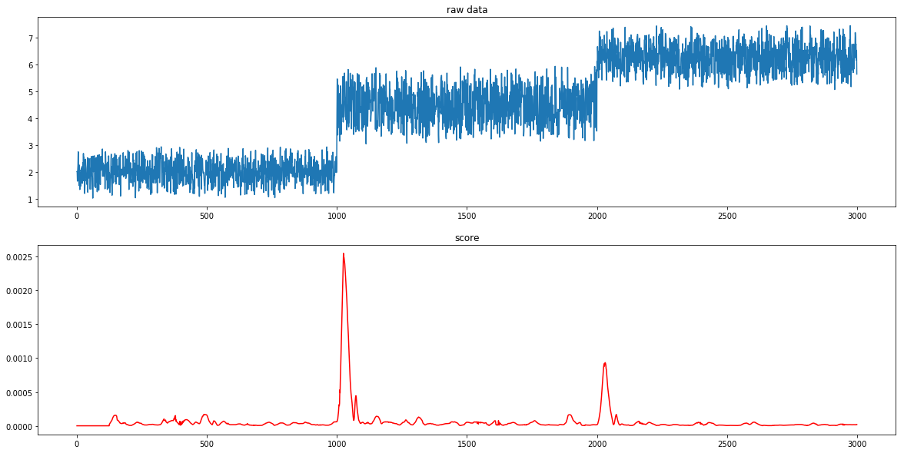
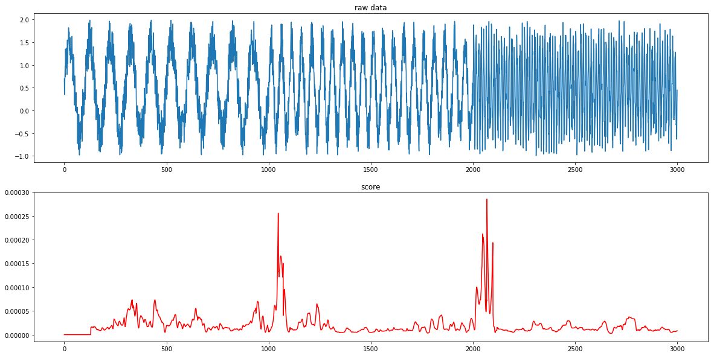

[](https://travis-ci.org/statefb/singular-spectrum-transformation)  
# SST (Singular Spectrum Transformation)
A fast implementation of Singular Spectrum Transformation for python.

## What is SST?
A change point detection algorithm.


see more [examples](./example/examples.ipynb)

## Features
#### fast computation
* efficient algorithm using lanczos method
* [Numba](http://numba.pydata.org/)


## Installation
```
$pip install fastsst
```

## Usage
```usage.py
from fastsst import SingularSpectrumTransformation

sst = SingularSpectrumTransformation(win_length=30)

"""
note:
 - data must be 1d np.ndarray
 - the first run takes a few seconds for jit compling
"""
score = sst.score_offline(data)
```

## TODO
* online evaluation

## References
1. Tsuyoshi Ide, Koji Tsuda, Change-Point Detection using Krylov Subspace Learning, SIAM International Conference on Data Mining, pp.515-520, 2007
2. Tsuyoshi Ide, Speeding up Change-Point Detection using Matrix Compression (Japanse), Workshop on Information-Based Induction Sciences, 2006
3. Tsuyoshi Ide, Masashi Sugiyama, Anomaly Detection and Change Detection (Japanse), Kodansha, 2015
